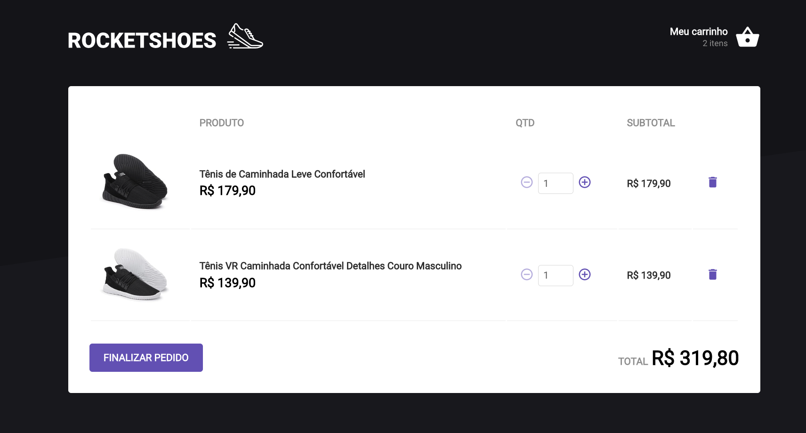

  

<h1 align="center">
  RocketShoes
</h1>

Desafio 03 - Criando um hook de carrinho de compras

## Desafio proposto

> O seu principal objetivo é criar um hook de carrinho de compras. Você terá acesso a duas páginas, um componente e um hook para implementar as funcionalidades pedidas nesse desafio

> Yarn 

> Yarn Server

> Yarn Start

# Requisitos

- [x] Adicionar um novo produto ao carrinho;
- [x] Remover um produto do carrinho;
- [x] Alterar a quantidade de um produto no carrinho;
- [x] Cálculo dos preços sub-total e total do carrinho;
- [x] Validação de estoque;
- [x] Exibição de mensagens de erro;
